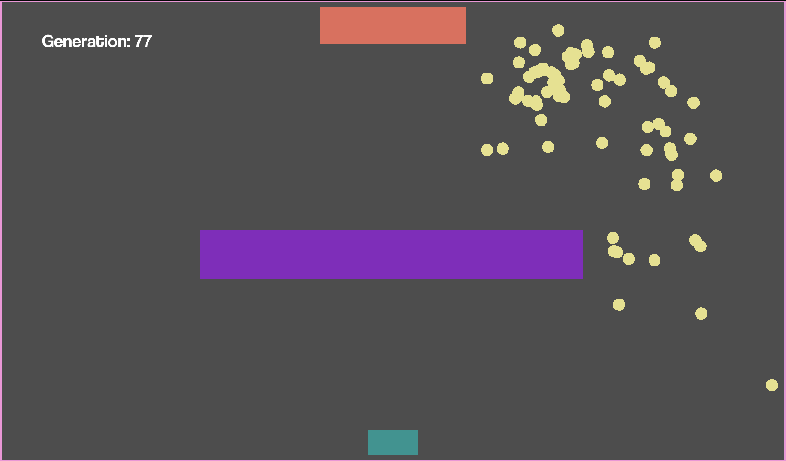

# ai-pathfinding

- Uses godot game engine and genetic algorithm
- These are basically smart dots that learn how to get to a certain point
- It takes them approximately 5 generations to get to the destination
- If they touch anything they sort of die
- There is one obstacle they need to avoid

